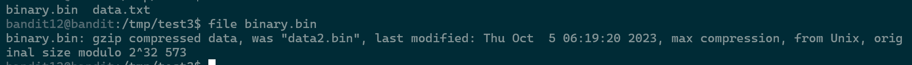
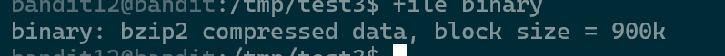
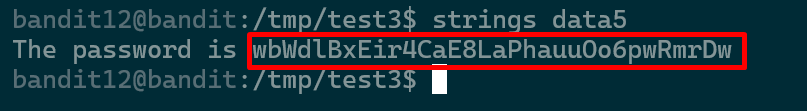

# Level 12 -> Level 13 


### Challnge này giúp mình hiểu về các loại nén 


> Đề bài : The password for the next level is stored in the file data.txt, which is a hexdump of a file that has been repeatedly compressed. For this level it may be useful to create a directory under /tmp in which you can work using mkdir. For example: mkdir /tmp/myname123. Then copy the datafile using cp, and rename it using mv (read the manpages!)

(đề bài nói là nén nhiều lần sau đó hexdump file -> giờ mình làm ngược lại là done)

Step1  : phải tạo file mới trong /tmp bởi vì trong home mình ko có quyền mv được cái file đó , mục đích của đổi tên là thêm hậu tố của các loại nén khác nhau 

```
 cd /tmp ; mkdir test1 ; cp /home/bandit12 data.txt 
```
Step2 : tiến hành lấy raw data từ hex dump 
```
xxd -r data.txt > binary
```

Step3 : tiến hành giải nén đến khi nào ra ASCII text thì thôi 
Kiểm tra loại nén bằng 
```
file binary.bin
```
Lần 1 : 


Được nén bằng gzip 

Tiến hành đổi tên file 
```
mv binary.bin binary.gz ; gunzip binary.gz
```
Lần 2 :



Được nén bằng bz , tương tự các lần sau đó 




# FLAG
```
 wbWdlBxEir4CaE8LaPhauuOo6pwRmrDw
```
