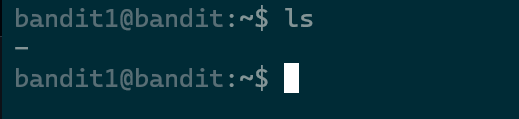

# Level 1 -> Level 2 

### Mình đã lấy được password của bandit1 từ readme của bandit0 

```
ssh -p 2220  bandit1@bandit.labs.overthewire.org 

```
Vào thư mục home và kiểm tra bằng **ls** 
***

***
mình thử cat nó bằng cú pháp thông thường không được 
> Hint nó là dashed filename 

## dashed filename là gì ? 
 chỉ đơn giản là các file có **-** ở trước tên của chúng , nó làm điều nên sự khác biệt là khi thao tác với nó thì hay bị nhầm lẫn với syntax của shell , nên cách 

 ```
 có hai cách thao tác với các file dashed filename 
 1 . nano -- -abc.txt 
 2 . nano ./-abc.txt
 ```
***
Suy ra syntax mở file sẽ như sau 
```
 cat -- ./-
```

# Flag 
```
rRGizSaX8Mk1RTb1CNQoXTcYZWU6lgzi
```

