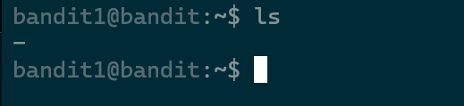

# Level 1 -> Level 2 

### Mình đã lấy được password của bandit1 từ readme của bandit0 

```
ssh -p 2220  bandit1@bandit.labs.overthewire.org 

```
Vào thư mục home và kiểm tra bằng **ls** 
***

***
mình thử cat nó bằng cú pháp thông thường không được 
> Hint nó là dashed filename 

## dashed filename là gì ? 


