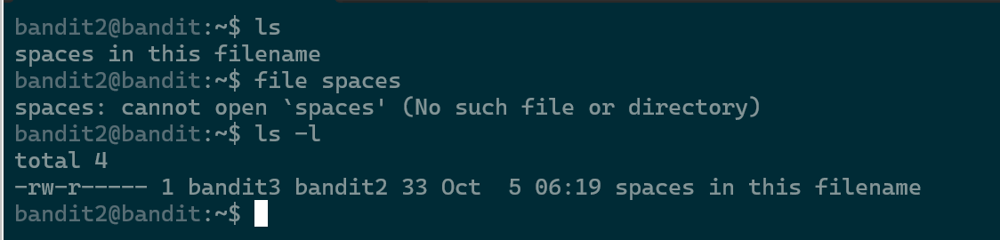

# Level 2 -> Level 3 


### Lab này nó yêu cầu mở file có chứa space 

***


Hướng xử lí có hai cách 
```
1. Mở tất cả các file trong thư mực :  cat *
2. Đưa filename vào trong " "       : cat "spaces in this filename"
```

# FLAG
```
aBZ0W5EmUfAf7kHTQeOwd8bauFJ2lAiG
```