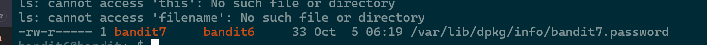

# Level 6 -> level 7


## Challenge này vẫn bắt mình tìm kiếm file 

ĐỀ bảo nó được dấu đâu đó trong server thỏa mãn các yêu cầu sau  
+ Owenr là bandit7
+ Group là bandit6 
+ Size là 33 bytes 

**kết hợp pipe line ở level trước và thêm 1 chút regex**

### Nói qua về regex 
 Nó như kiểu là khuân mẫu (pattern) để chúng ta đối chiếu , nếu input vào mà khớp với cái pattern thì nó sẽ pass , còn ko sẽ ko lấy 
 
 ```
 Trong regex : 
 . :  Đại diện cho bất kì phần tử nào
 * :  Đại diện cho 0 hoặc nhiều lần xuất hiện 
 | : hoặc pattern này hoặc pattern kia
 ```

 ## Lưu ý về pipe line 
 ### Phân biệt standrad input output ?
   Các dữ liệu được đưa vào qua **stdin** từ bàn phím hăojc từ việc chuyển đổi đầu vào của một tiến trình trước đó 
 xargs đọc dữ liệu và biến nó thành đối số của lệnh sau ! 

 ```
 find / -type f  -size 33c | xargs ls -l | grep 'bandit7.*bandit6' 
 ```

output :
***

 
 # FLag 
```
z7WtoNQU2XfjmMtWA8u5rN4vzqu4v99S
```